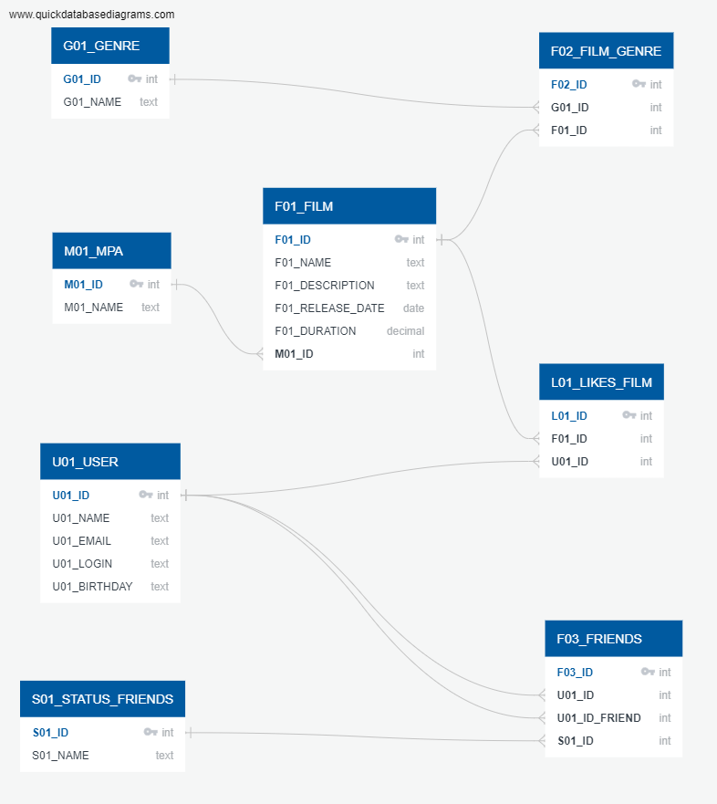

## ER-диаграмма

***
### Описание Film
**«Жанр» (англ. Genre)**. У фильма может быть сразу несколько жанров, а у поля — несколько значений. Например, таких:
+ Комедия
+ Драма
+ Мультфильм
+ Триллер
+ Документальный
+ Боевик

**Рейтинг Ассоциации кинокомпаний (англ. Motion Picture Association, сокращённо МРА)**. Эта оценка определяет возрастное ограничение для фильма. Значения могут быть следующими:
+ G — у фильма нет возрастных ограничений
+ PG — детям рекомендуется смотреть фильм с родителями
+ PG-13 — детям до 13 лет просмотр не желателен
+ R — лицам до 17 лет просматривать фильм можно только в присутствии взрослого
+ NC-17 — лицам до 18 лет просмотр запрещён


### Описание User
**Статус для связи «дружба»** между двумя пользователями:
+ _неподтверждённая_ — когда один пользователь отправил запрос на добавление другого пользователя в друзья,
+ _подтверждённая_ — когда второй пользователь согласился на добавление.

***
Пример запроса: Получение топ-10 названий фильмов по количеству лайков:
```
SELECT "F01_NAME"
FROM "F01_FILM"
WHERE "F01_ID" IN (SELECT "F01_ID"
                  FROM "L01_LIKES_FILM"
                  GROUP BY "F01_ID"
                  ORDER BY COUNT("U01_ID") DESC
                  LIMIT 10);
```
Получение id и логинов друзей по id пользователя = 1:
```
SELECT u."U01_LOGIN",
       u."U01_ID"
FROM "U01_USER" AS u
WHERE u."U01_ID" IN (SELECT f."U01_ID_FRIEND"
                    FROM "F01_FRIENDS" AS f
                    WHERE f."U01_ID" = 1);
```